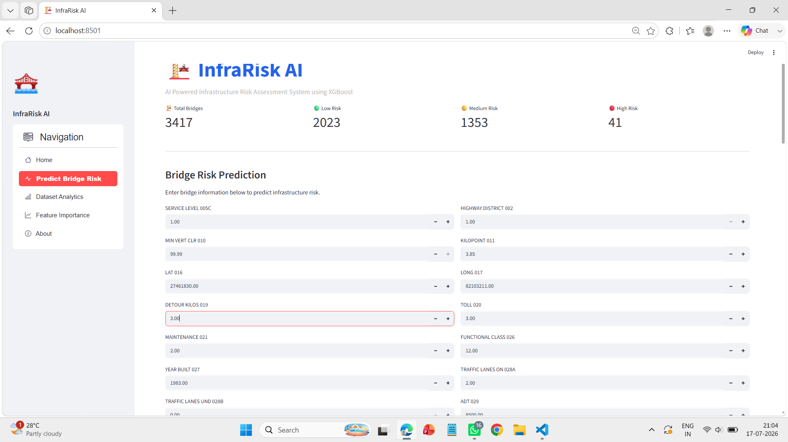
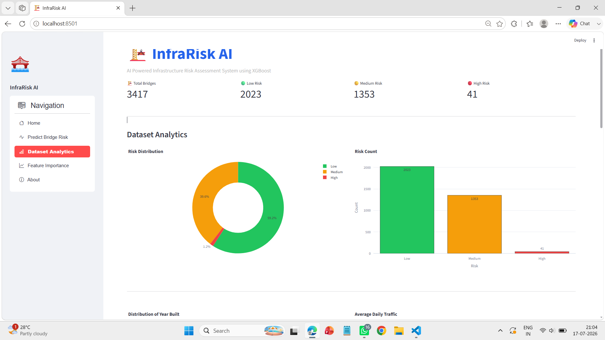
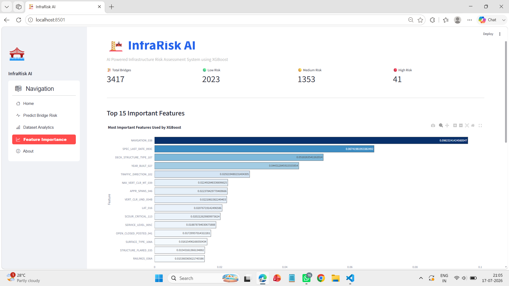
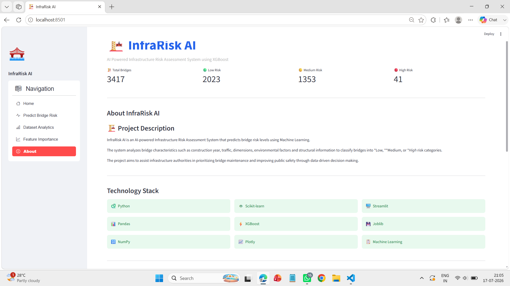

# 🏗️ InfraRisk AI

AI Powered Infrastructure Risk Assessment System using Machine Learning (XGBoost)

---

# 📖 Project Overview

InfraRisk AI is an end-to-end Machine Learning project developed to assess bridge infrastructure risk using the Florida Bridge Dataset.

The system predicts whether a bridge belongs to one of the following categories:

- 🟢 Low Risk
- 🟡 Medium Risk
- 🔴 High Risk

The project combines Data Cleaning, Feature Engineering, Machine Learning, Model Evaluation and an interactive Streamlit Dashboard to help visualize infrastructure health and support data-driven maintenance decisions.

---

# ✨ Features

- End-to-End Machine Learning Pipeline
- Data Cleaning & Preprocessing
- Feature Engineering
- XGBoost Classification Model
- Interactive Streamlit Dashboard
- Infrastructure Risk Prediction
- Confidence Score
- Dataset Analytics
- Correlation Heatmap
- Feature Importance Visualization
- Professional Dashboard UI
- Complete Documentation

---

# 📸 Dashboard Preview

## 🏠 Home Page

---

## 🤖 Bridge Risk Prediction

---

## 📊 Dataset Analytics

---

## ⭐ Feature Importance

---

## ℹ️ About

---

# 📂 Project Structure

text
InfraRisk-AI/

├── dashboard/
│   └── app.py
│
├── data/
│   ├── florida_bridge_cleaned.csv
│   └── florida_bridge_with_risk_final.csv
│
├── docs/
│   ├── dashboard.md
│   ├── methodology.md
│   ├── model_performance.md
│   └── project_overview.md
│
├── models/
│   ├── xgboost_model.pkl
│   ├── random_forest.pkl
│   ├── label_encoder.pkl
│   └── features.pkl
│
├── notebooks/
│   ├── eda.ipynb
│   ├── target_creation.ipynb
│   └── model_training.ipynb
│
├── screenshots/
│   ├── home.png
│   ├── prediction.png
│   ├── analytics.png
│   ├── feature_importance.png
│   └── about.png
│
├── README.md
├── requirements.txt
├── LICENSE
└── .gitignore

---

# ⚙️ Machine Learning Workflow

Florida Bridge Dataset
            │
            ▼
     Data Cleaning
            │
            ▼
 Feature Engineering
            │
            ▼
  Target Creation
            │
            ▼
  Train-Test Split
            │
            ▼
Decision Tree
Random Forest
XGBoost
            │
            ▼
Model Evaluation
            │
            ▼
Best Model (XGBoost)
            │
            ▼
Streamlit Dashboard
# 📊 Dataset Information

The project uses the *Florida Bridge Dataset*, which contains structural and operational information about bridges across Florida.

### Dataset Highlights

| Attribute | Details |
|-----------|----------|
| Dataset | Florida Bridge Dataset |
| Records | 3,417 Bridges |
| Features | 68 Selected Features |
| Target Variable | Infrastructure Risk |
| Risk Classes | Low, Medium, High |

---

# 🧹 Data Preprocessing

The following preprocessing steps were performed before model training:

- Removed unnecessary columns
- Handled missing values
- Converted categorical features into numerical representations
- Selected relevant bridge attributes
- Created Infrastructure Risk target labels
- Performed Train-Test Split (80:20)

---

# 🏷️ Target Creation

Infrastructure Risk was generated using bridge condition ratings.

| Condition Score | Risk Category |
|-----------------|---------------|
| Poor | 🔴 High Risk |
| Fair | 🟡 Medium Risk |
| Good | 🟢 Low Risk |

This custom target allows the Machine Learning model to classify bridges based on their overall condition.

---

# 🤖 Machine Learning Models

Three classification models were trained and evaluated.

| Model | Accuracy |
|--------|----------|
| Decision Tree | *69.4%* |
| Random Forest | *73.4%* |
| *XGBoost* | *74.7%* ✅ |

After evaluation, *XGBoost* achieved the highest accuracy and was selected for deployment in the Streamlit dashboard.

---

# 📈 Model Evaluation Metrics

The model was evaluated using:

- Accuracy
- Precision
- Recall
- F1-Score
- Confusion Matrix

The XGBoost model demonstrated the best balance between prediction accuracy and generalization.

---

# 🖥️ Dashboard Modules

The Streamlit dashboard contains five interactive sections.

## 🏠 Home

- Project Overview
- KPI Cards
- Dataset Summary
- Model Comparison
- Risk Distribution

---

## 🤖 Predict Bridge Risk

- Dynamic input fields
- AI-powered prediction
- Confidence score
- Color-coded risk level
- Uses trained XGBoost model

---

## 📊 Dataset Analytics

- Risk Distribution Pie Chart
- Risk Distribution Bar Chart
- Year Built Histogram
- Average Daily Traffic Histogram
- Correlation Heatmap
- Statistical Summary

---

## ⭐ Feature Importance

Displays the Top 15 most important features learned by the XGBoost model.

This helps explain which bridge attributes contribute the most to risk prediction.

---

## ℹ️ About

Includes:

- Project Description
- Technology Stack
- Model Performance
- Developer Information

---

# 🛠️ Technology Stack

### Programming Language

- Python

### Data Processing

- Pandas
- NumPy

### Machine Learning

- Scikit-learn
- XGBoost

### Visualization

- Plotly
- Matplotlib

### Dashboard

- Streamlit
- Streamlit Option Menu

### Model Serialization

- Joblib

# 🚀 Installation

Clone the repository

bash
git clone https://github.com/your-username/InfraRisk-AI.git

Navigate to the project folder

bash
cd InfraRisk-AI

Install the required dependencies

bash
pip install -r requirements.txt

---

# ▶️ Run the Application

Start the Streamlit dashboard

bash
streamlit run dashboard/app.py

The dashboard will be available at:

http://localhost:8501

---

# 📦 Requirements

Main libraries used in this project:

- Python 3.11+
- Streamlit
- Pandas
- NumPy
- Scikit-learn
- XGBoost
- Plotly
- Joblib
- streamlit-option-menu

Install all dependencies using:

bash
pip install -r requirements.txt

---

# 📈 Results

- Successfully built an end-to-end Machine Learning pipeline.
- Developed an interactive Streamlit dashboard.
- Achieved *74.7% accuracy* using the XGBoost Classifier.
- Visualized bridge risk distribution through interactive analytics.
- Identified the most influential features affecting infrastructure risk.

---

# 🔮 Future Improvements

The project can be further enhanced by adding:

- 🌍 Interactive GIS Bridge Map
- ☁️ Cloud Deployment (AWS / Azure / GCP)
- 📱 Mobile Responsive Dashboard
- 🔔 Real-time Bridge Monitoring
- 🌦️ Weather Data Integration
- 📡 IoT Sensor Data Integration
- 🤖 Explainable AI (SHAP / LIME)
- 🔌 REST API using FastAPI
- 🧠 Deep Learning Models
- 📄 Automatic PDF Report Generation

---

# 📚 Documentation

Detailed project documentation is available in the *docs/* folder.

- Project Overview
- Methodology
- Dashboard Guide
- Model Performance
- Future Scope

---

# 👨‍💻 Author

## Manish Parihar

*B.Tech Computer Science Engineering*

Machine Learning | Data Science | Artificial Intelligence

### Skills

- Python
- Machine Learning
- Data Analysis
- Data Visualization
- Streamlit
- XGBoost
- Scikit-learn
- Pandas
- NumPy

---

# 🤝 Contributions

Contributions, suggestions, and improvements are welcome.

If you have ideas to improve this project, feel free to fork the repository and submit a Pull Request.

---

# 📄 License

This project is licensed under the *MIT License*.

See the LICENSE file for more details.

---

# ⭐ Support

If you found this project useful:

⭐ Star this repository

🍴 Fork this repository

📢 Share it with others

---

## 🏗️ InfraRisk AI

### AI Powered Infrastructure Risk Assessment System

*Developed by Manish Parihar*

Made with ❤️ using Python, XGBoost and Streamlit.

